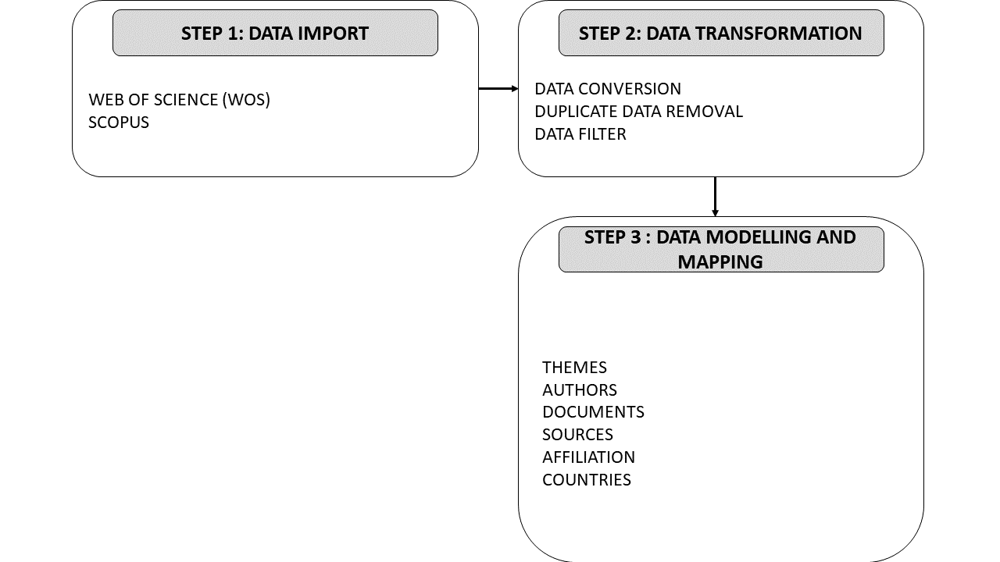

<div style="text-align: justify">

```{r , results = 'hide', echo = F, warning = F, message = F, error = F}


library(magrittr)


library(bibliometrix)


library(tidyverse)


# Importação dos dados da base Web Of Science:
dados_wos <- bibliometrix::convert2df(file = list.files(path = '../dados/arquivos_wos_12_04_21', full.names = TRUE),
                              
                              dbsource = 'wos',
                              
                              format = 'bibtex') %>% 

  dplyr::filter(DT == 'ARTICLE',
                
                PY <= 2020,
                
                LA == 'ENGLISH',
                
                !stringr::str_detect(ID,'RUGBY'),
                
                !stringr::str_detect(ID,'MEDICINE'),
                
                !stringr::str_detect(ID,'CONCUSSION'),
                
                !stringr::str_detect(ID,'EPIDEMIOLOGY'),
                
                !stringr::str_detect(ID,'INJURY'),
                
                !stringr::str_detect(ID,'GPS'),
                
                !stringr::str_detect(ID,'KNEE'),
                
                !stringr::str_detect(DE,'RUGBY'),
                
                !stringr::str_detect(DE,'CONCUSSION'),
                
                !stringr::str_detect(DE,'EPIDEMIOLOGY'),
                
                !stringr::str_detect(DE,'INJURY'),
                
                !stringr::str_detect(DE,'GPS'),
                
                !stringr::str_detect(DE,'KNEE'),
                
                !stringr::str_detect(DE,'MEDICINE'))
                
               
                    
              

# Importação dos dados da base scopus:
dados_scopus <- bibliometrix::convert2df(file = list.files(path = '../dados/arquivos_scopus_12_04_21', full.names = TRUE),
                              
                              dbsource = 'scopus',
                              
                              format = 'bibtex') %>% 

  dplyr::filter(DT == 'ARTICLE',
                
                PY <= 2020,
                
                LA == 'ENGLISH',
                
                 !stringr::str_detect(ID,'RUGBY'),
                
                !stringr::str_detect(ID,'MEDICINE'),
                
                !stringr::str_detect(ID,'CONCUSSION'),
                
                !stringr::str_detect(ID,'EPIDEMIOLOGY'),
                
                !stringr::str_detect(ID,'INJURY'),
                
                !stringr::str_detect(ID,'GPS'),
                
                !stringr::str_detect(ID,'KNEE'),
                
                !stringr::str_detect(DE,'RUGBY'),
                
                !stringr::str_detect(DE,'CONCUSSION'),
                
                !stringr::str_detect(DE,'EPIDEMIOLOGY'),
                
                !stringr::str_detect(DE,'INJURY'),
                
                !stringr::str_detect(DE,'GPS'),
                
                !stringr::str_detect(DE,'KNEE'),
                
                !stringr::str_detect(DE,'MEDICINE'))
                
                # ID != 'MEDICINE',
                # 
                # JI != 'MEDICINE',
                # 
                # SO != 'MEDICINE')
            


# Juntando os resultados das suas bases e removendo os documentos duplicados:
M <- bibliometrix::mergeDbSources(dados_wos, dados_scopus, remove.duplicated = TRUE) 


# Calculando a base dos indicadores bibliométricos:
results <- bibliometrix::biblioAnalysis(M)


sumario <- summary(results, k = 10, pause = F)


LCdata <- bibliometrix::localCitations(M, fast.search = FALSE, sep = ';')


histResults <- bibliometrix::histNetwork(M, min.citations = 10, sep = ";")
```

# Introduction

# Capítulo teste

## capitulo teste 1.1

este é um capitulo teste
não foi dado 2 enters

foi dado 1 enter

# Methodology

O presente trabalho foi organizado em uma sequência de três passos, Data
Import, Data Transformation e Data Modelling and Mapping conforme
apresentado na Figura 3.1:


```{r , results = 'asis', echo = F, warning = F, message = F, error = F, fig.align ='center', out.width='100%', fig.cap = 'Figure 3.1 – Flow chart showing data collection, modelling and mapping'}


# Incluindo a Figura do método



```


A etapa de importação de dados consiste em gerar arquivos nas bases de
dados cientifícos Scopus e Web of Science com metadados informações de
citação, bibliográficas e de referência, palavras-chave, resumo e
detalhes de financiamento a respeito dos artigos de educação financeira.

Sobre este aspecto, cumpre destacar que em ambas as bases de dados foi
utilizado como único descritor a palavra-chave "Financial Literacy"
buscado nos tópicos dos artigos (título, resumo, authors keywords e
keywords plus) dos artigos. Limitou-se a amostra a apenas artigos de
língua inglesa publicados até o ano de 2020, sendo que, os dois
primeiros filtros são necessários na medida em que padronizam o estilo
de referências e também de codificação, enquanto que, o filtro de
período foi aplicado para que a análise seja aplicada apenas para os
anos completos. Nesta etapa foram encontrados **XXXX** documentos e
**XXXX** nas bases de dados Scopus e Web of Science, respectivamente.

Por sua vez, a etapa de tranformação dos dados tem por finalidade
transformar os metadados importados uma única única planilha consolidada
com todas as informações de ambas as bases de dados, excluindo-se as
informações duplicadas

Após aplicação dos filtros, foram organizados os metadados de 1479 e
1814 artigos de língua inglesa sobre educação financeira até o ano de
2020 nas bases de dados Scopus e Web of Science, respectivamente.

Ao aplicar as etapas de análise descritas acima, pode-se obter a coleção
de artigos a serem analisados. Neste sentido, as principais informações
a respeito da coleção de artigos é apresentada na Tabela 1.1, abaixo:

```{r , results = 'asis', echo = F, warning = F, message = F, error = F, fig.align ='center', out.width='100%', fig.cap = 'Table 3.1 – Main information about data'}


main <- tibble::as_tibble(sumario[["MainInformationDF"]]) %>% 
  
  dplyr::filter(!Description %in% c('MAIN INFORMATION ABOUT DATA',
                                    
                                    'DOCUMENT TYPES',
                                    
                                    'article',
                                    
                                    'DOCUMENT CONTENTS',
                                    
                                    'AUTHORS',
                                    
                                    'Author Appearances',
                                    
                                    'AUTHORS COLLABORATION',
                                    
                                    'Co-Authors per Documents'))


knitr::kable(main)
```

# Results

## Overview

## Conceptual Structure Analysis

Como fazer a análise: • Os temas no quadrante superior direito são bem
desenvolvidos e importantes para a estruturação de um campo de pesquisa.
Eles são conhecidos como temas motores da especialidade, pois apresentam
forte centralidade e alta densidade. A colocação de temas nesse
quadrante implica que eles estejam relacionados externamente a conceitos
aplicáveis a outros temas que estão conceitualmente intimamente
relacionados.

• Os temas no quadrante superior esquerdo desenvolveram laços internos
bem desenvolvidos, mas laços externos sem importância e, portanto, são
de importância apenas marginal para o campo. Esses temas são muito
especializados e de caráter periférico.

• Os temas no quadrante inferior esquerdo são pouco desenvolvidos e
marginais. Os temas desse quadrante têm baixa densidade e baixa
centralidade, representando principalmente temas emergentes ou
desaparecendo.

• Os temas no quadrante inferior direito são importantes para um campo
de pesquisa, mas não são desenvolvidos. Portanto, esse quadrante agrupa
temas transversais e gerais, básicos.

```{r , results = 'asis', echo = F, warning = F, message = F, error = F, fig.align ='center', out.width='100%', fig.cap = 'Figure 4.3 – Thematic Map'}


Map=thematicMap(M, field = 'ID', n = 250, minfreq = 5,
  stemming = FALSE, size = 0.5, n.labels=3, repel = TRUE) 


plot(Map$map)


```

dasdasd

```{r , results = 'asis', echo = F, warning = F, message = F, error = F, fig.align ='center', out.width='100%', fig.cap = 'Figure 4.4 – Word growth'}


worddynamics <- KeywordGrowth(M, Tag = 'ID', sep = ";", top = 10, cdf = TRUE)

worddynamics %>% 
  
  pivot_longer(!(Year), names_to = 'Words', values_to = 'Ndy') %>% 
  
  ggplot(worddynamics, mapping = aes(x = Year, y = Ndy, color = Words)) + 
  
  geom_line() +
  
  geom_point() +
  
  ylab('Annual Occurrences')


```

## Authors Analysis

Em primeiro lugar, para se ter uma visão geral da produtividades dos
autores neste campo de estudo testou-se o ajuste a lei de lotka.

```{r , results = 'asis', echo = F, warning = F, message = F, error = F, fig.align ='center', out.width='100%', fig.cap = 'Figure 4.5 – Scientific Productivity'}

L <- lotka(results)

# Beta coefficient estimate
#L$Beta
# Constant
#L$C
# Goodness of fit
#L$R2
# P-value of K-S two sample test
#L$p.value

Lobserved <- L[["AuthorProd"]]

Lobserved <- as_tibble(Lobserved)

colnames(Lobserved) <- c('Articles', 'Authors', 'Observed')

Theoretical <- 10^(log10(L$C)-2*log10(L$AuthorProd[,1]))

Theoretical <- as_tibble(Theoretical)

colnames(Theoretical) <- c('Theoretical')

lotkatest <- cbind(Lobserved, Theoretical)

lotkatest$Observed <- as.numeric(lotkatest$Observed)
  
lotkatest$Theoretical <- as.numeric(lotkatest$Theoretical)

lotkatest <- lotkatest %>% 
  gather(Observed,
         Theoretical,
         key = 'Type',
         value = 'Value')

ggplot(lotkatest, mapping = aes(x = Articles, y = Value, color = Type)) + 
  geom_line() + 
  geom_point() + 
  ylab('Freq. of Authors') + 
  xlab('Articles')


```

A partir da aplicação do teste de duas amostras de Kolmogorov-Smirnoff
calculou-se um p-valor da ordem de 0,15, atestando que não há diferença
significativa entre as distribuições de Lotka observada e teórica.

Já na Tabela a seguir, pode-se observar o impacto para a literatura dos
autores mais produtivos a partir dos indicadores...

```{r , results = 'asis', echo = F, warning = F, message = F, error = F, fig.align ='center', out.width='100%', fig.cap = 'Table 4.1 – Authors Impact'}

LCauthor <- as_tibble(LCdata[['Authors']])

colnames(LCauthor) <- c('Authors','Local Citations') 

authors <- gsub(","," ",names(results$Authors)[1:10])

indices <- Hindex(M, field = "author", elements=authors, sep = ";", years = 50)

indices <- as_tibble(indices[["H"]])

colnames(indices) <- c('Authors',
                       'H_Index',
                       'G_Index',
                       'M_Index',
                       '1',
                       'Documents',
                       '2')

indices <- indices %>% 
  select(Authors,
         H_Index,
         G_Index,
         M_Index,
         Documents)

AuthorsFrac <- as_tibble(results[["AuthorsFrac"]])

colnames(AuthorsFrac) <- c('Authors','Documents_fractionalized') 

tabauthors <- full_join(indices, AuthorsFrac, 'Authors')

tabauthors <- full_join(tabauthors, LCauthor, 'Authors')

tabauthors <- na.omit(tabauthors)

tabauthors$M_Index <- round(as.numeric(tabauthors$M_Index),2)

tabauthors$Documents_fractionalized <- round(as.numeric(tabauthors$Documents_fractionalized),2)

knitr::kable(tabauthors)

```

Realizar avaliações gerais.

```{r , results = 'asis', echo = F, warning = F, message = F, error = F, fig.align ='center', out.width='100%', fig.cap = 'Figure 4.6 – Authors Collaboration'}


NetMatrix <- biblioNetwork(M, analysis = "collaboration",  network = "authors", sep = ";")

net=networkPlot(NetMatrix,  normalize = "salton", weighted = NULL, n = 100, 
                Title = '', 
                type = 'fruchterman', 
                size = 10,
                size.cex = T,
                remove.multiple = T,
                labelsize = 1,
                label.n = 10,
                label.cex = F)

```

sadasdasd

## Documents Analysis

```{r , results = 'asis', echo = F, warning = F, message = F, error = F, fig.align ='center', out.width='100%', fig.cap = 'Table 4.2 – Most Cited Documents'}

LPapers <- as_tibble(LCdata[['Papers']])

LPapers <- LPapers[1:10,]

colnames(LPapers) <- c('Papers','DOI', 'Year', 'Local Citations', 'Global Citations') 

knitr::kable(LPapers)


```

Mapa historigrafico:

```{r , results = 'hide', echo = F, warning = F, message = F, error = F, fig.align ='center', out.width='100%', fig.cap = 'Figure 4.7 – Historiograph'}


net <- histPlot(histResults, n = 20, size = 10, labelsize = 5,)


```

## Sources Analysis

```{r , results = 'asis', echo = F, warning = F, message = F, error = F, fig.align ='center', out.width='100%', fig.cap = 'Figure 4.8 – Sources Dynamics'}


M1 <- M %>% 
  select(SO, PY) %>% 
  mutate(Documents = 1) %>% 
  group_by(SO, PY) %>% 
  mutate(Soma = sum(Documents))

M1 <- M1[!duplicated(M1),]

M1 <- M1 %>% 
  select(SO, PY, Soma)

colnames(M1) <- c('Sources','Years','Documents')

sources <- as_tibble(results[['Sources']])

sources <- sources[1:10,]

colnames(sources) <- c('Sources', 'n')

M1 <- full_join(M1, sources, 'Sources')

M1 <- na.omit(M1)

M1 <- M1 %>% 
  group_by(Sources) %>% 
  arrange(Years) %>% 
  mutate(Documents = cumsum(Documents))

M1$Documents <- as.numeric(M1$Documents)

M1$Years <- lubridate::ymd(M1$Years, truncated = 2L)

ggplot(M1, mapping = aes(x = Years, y = Documents, color = Sources)) + 
  geom_line() +
  xlab('Years') + 
  ylab('Documents (cumulative sum) ')


```

```{r , results = 'asis', echo = F, warning = F, message = F, error = F, fig.align ='center', out.width='100%', fig.cap = 'Table 4.3 – Sources Impact'}


sources <- as_tibble(results[['Sources']])

sources <- sources[1:10,]

indices <- Hindex(M, field = 'source', elements = sources$SO, sep = ';', years = 50)

indices <- as_tibble(indices[["H"]])

colnames(indices) <- c('Sources',
                       'H_Index',
                       'G_Index',
                       'M_Index',
                       '1',
                       'Documents',
                       '2')

indices <- indices %>% 
  select(Sources,
         H_Index,
         G_Index,
         M_Index,
         Documents)

indices$M_Index <- round(as.numeric(indices$M_Index),2)

knitr::kable(indices)


```

## Affiliation Analysis

```{r , results = 'asis', echo = F, warning = F, message = F, error = F, fig.align ='center', out.width='100%', fig.cap = 'Table 4.4 – Affiliations Productivity'}


Affiliations <- as_tibble(results[["Affiliations"]])

Affiliations <- Affiliations[1:10,]

colnames(Affiliations) <- c('Affiliations','Documents')

knitr::kable(Affiliations)

```

```{r , results = 'asis', echo = F, warning = F, message = F, error = F, fig.align ='center', out.width='100%', fig.cap = 'Figure 4.9 – Affiliations Collaboration Network'}


NetMatrix <- biblioNetwork(M, analysis = "collaboration",  network = "universities", sep = ";")

net=networkPlot(NetMatrix,  normalize = "salton", weighted = NULL, n = 100, 
                Title = '', 
                type = 'fruchterman', 
                size = 10,
                size.cex = T,
                remove.multiple = T,
                labelsize = 1,
                label.n = 10,
                label.cex = F)

```

## Countries Analysis

```{r , results = 'asis', echo = F, warning = F, message = F, error = F, fig.align ='center', out.width='100%', fig.cap = 'Table 4.5 – Countries Productivity'}


Countries <- as_tibble(results[['Countries']])

Countries <- Countries[1:10,]

colnames(Countries) <- c('Countries','Documents')

knitr::kable(Countries,
             
             escape = FALSE,
    
             format = 'html',
             
             align = c('c', 'l', 'l')) 


```


```{r , results = 'asis', echo = F, warning = F, message = F, error = F, fig.align ='center', out.width='100%', fig.cap = 'Figure 4.10 – Countries Collaboration'}


CountriesCo <- as_tibble(results[["CountryCollaboration"]])

CountriesCo <- CountriesCo[1:10,]

CountriesCo <- CountriesCo %>% 
  mutate(Ratio = round((MCP/(SCP+MCP)),2))

colnames(CountriesCo) <- c('Countries','SCP', 'MCP', 'Ratio')

CountriesCo <- CountriesCo %>% 
  gather(SCP,
         MCP,
         key = 'Collaboration',
         value = 'Value')

CountriesCo$Value <- as.numeric(CountriesCo$Value)
CountriesCo <- CountriesCo %>% 
  
  filter(Collaboration!="SCP") %>% 
  
  mutate(Countries = fct_reorder(Countries, Ratio))


ggplot(CountriesCo, mapping = aes(y = Countries, x = Ratio)) +
  geom_col() + 
  ylab('Ratio of Collaboration') 


```

```{r , results = 'asis', echo = F, warning = F, message = F, error = F, fig.align ='center', out.width='100%', fig.cap = 'Figure 4.3 – Countries collaboration Network'}


M <- metaTagExtraction(M, Field = "AU_CO", sep = ";")

NetMatrix <- biblioNetwork(M, analysis = "collaboration",  network = "countries", sep = ";")

net=networkPlot(NetMatrix,  normalize = "salton", weighted = NULL, n = 100, 
                Title = '', 
                type = 'fruchterman', 
                size = 10,
                size.cex = T,
                remove.multiple = T,
                labelsize = 1,
                label.n = 10,
                label.cex = F)


```

# CONCLUSÕES
